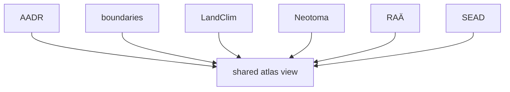

# Source Comparison

Each supported source family answers a different kind of question.

## Comparison Model

Layers can render together while still answering different kinds of questions.
Similar shapes on the map do not mean similar evidence claims underneath.

## Which Source Helps With Which Question

- AADR supports ancient DNA sample-locality and country-report questions
- Boundaries support country framing and map filtering questions
- LandClim supports pollen sequence and REVEALS context questions
- Neotoma supports paleoecological pollen-site context questions
- RAÄ supports Sweden-scoped archaeology density questions
- SEAD supports broader environmental archaeology context questions

## Evidence Audit

- open [Source family matrix](source-family-matrix.md) when the question is
  which family is primary, contextual, or currently under-acquired
- open [Animal Project and Paper Inventory](animal-project-and-paper-inventory.md)
  when the question is specifically paper capture, supplements, and sample
  extraction

## Boundary

The atlas is strongest when these roles stay separate. A point or polygon can
look similar on the map while representing a very different source claim,
geographic scope, and refresh story underneath.

## First Proof Check

- inspect the matching source page before making a source-wide claim
- open [Nordic Atlas Outputs](https://bijux.io/bijux-pollenomics/02-bijux-pollenomics-data/outputs/nordic-atlas/)
  when the question is how these families are rendered together on the
  publication surface

## Design Pressure

The common failure is to compare sources by visual similarity on the atlas
instead of by the narrower question each source family can honestly answer.
