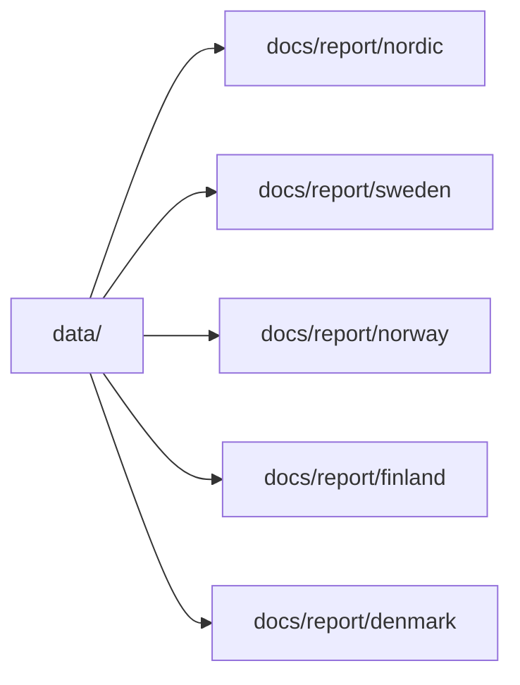

# Generate Reports and Map Outputs

Once the data tree exists, generate the shared map and any country reports you want to publish or inspect.

## Current Published Set

```bash
make reports
```

Equivalent direct command:

```bash
PYTHONPATH=src artifacts/.venv/bin/python -m bijux_pollen.cli publish-reports --countries Sweden Norway Finland Denmark --version v62.0 --name nordic --title "Nordic Countries" --output-root docs/report --context-root data
```

That command rebuilds the current checked-in report tree in one pass.

## Shared Nordic Map

```bash
PYTHONPATH=src artifacts/.venv/bin/python -m bijux_pollen.cli report-multi-country-map Sweden Norway Finland Denmark --version v62.0 --name nordic --title "Nordic Countries" --context-root data
```

That command reads:

- AADR `.anno` files from `data/aadr/v62.0/`
- normalized context layers from `data/boundaries/`, `data/neotoma/`, `data/sead/`, and `data/raa/`

and writes the checked-in Nordic bundle under `docs/report/nordic/`.

## Country Reports

```bash
PYTHONPATH=src artifacts/.venv/bin/python -m bijux_pollen.cli report-country Sweden --version v62.0 --shared-map-label "Nordic Countries map" --shared-map-path "../nordic/nordic_aadr_v62.0_map.html"
PYTHONPATH=src artifacts/.venv/bin/python -m bijux_pollen.cli report-country Norway --version v62.0 --shared-map-label "Nordic Countries map" --shared-map-path "../nordic/nordic_aadr_v62.0_map.html"
PYTHONPATH=src artifacts/.venv/bin/python -m bijux_pollen.cli report-country Finland --version v62.0 --shared-map-label "Nordic Countries map" --shared-map-path "../nordic/nordic_aadr_v62.0_map.html"
PYTHONPATH=src artifacts/.venv/bin/python -m bijux_pollen.cli report-country Denmark --version v62.0 --shared-map-label "Nordic Countries map" --shared-map-path "../nordic/nordic_aadr_v62.0_map.html"
```

Each `report-country` command writes one country bundle under `docs/report/<country>/`.

## Output Model



## Purpose

This page gives the report-generation commands used for the current checked-in outputs.
