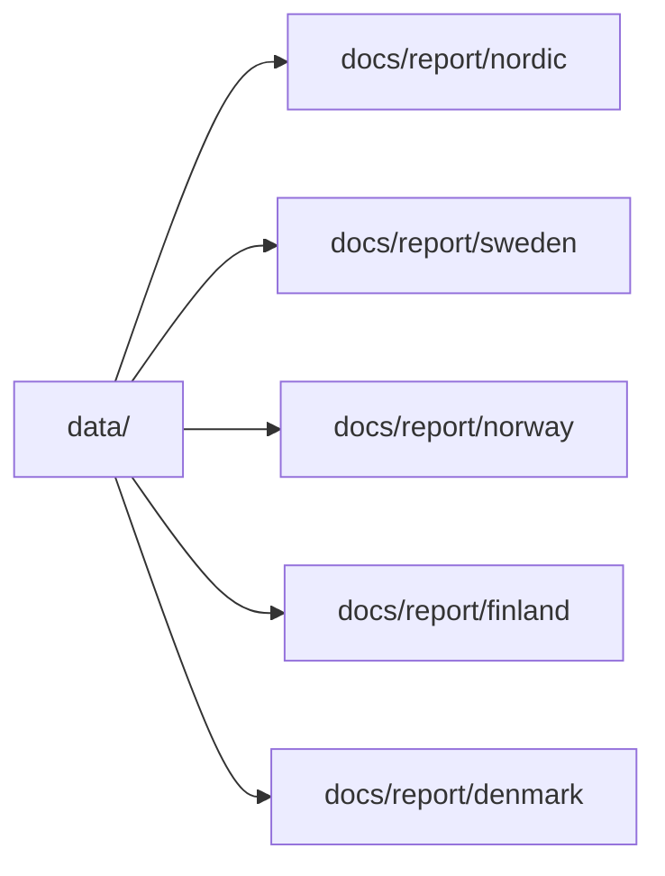

# Generate Reports and Map Outputs

Once the data tree exists, generate the interactive map and the country reports.

## Shared Nordic Map

```bash
PYTHONPATH=src .venv/bin/python -m bijux_pollen.cli report-multi-country-map Sweden Norway Finland Denmark --version v62.0 --name nordic --title "Nordic Countries" --context-root data
```

## Country Reports

```bash
PYTHONPATH=src .venv/bin/python -m bijux_pollen.cli report-country Sweden --version v62.0 --shared-map-label "Nordic Countries map" --shared-map-path "../nordic/nordic_aadr_v62.0_map.html"
PYTHONPATH=src .venv/bin/python -m bijux_pollen.cli report-country Norway --version v62.0 --shared-map-label "Nordic Countries map" --shared-map-path "../nordic/nordic_aadr_v62.0_map.html"
PYTHONPATH=src .venv/bin/python -m bijux_pollen.cli report-country Finland --version v62.0 --shared-map-label "Nordic Countries map" --shared-map-path "../nordic/nordic_aadr_v62.0_map.html"
PYTHONPATH=src .venv/bin/python -m bijux_pollen.cli report-country Denmark --version v62.0 --shared-map-label "Nordic Countries map" --shared-map-path "../nordic/nordic_aadr_v62.0_map.html"
```

## Output Model



## Purpose

This page gives the exact report-generation commands used for the checked-in outputs.
