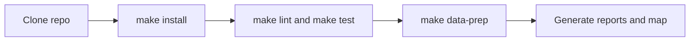

# Getting Started

This section is the shortest honest path from a fresh checkout to a working local environment, a rebuilt `data/` tree, and regenerated outputs.

It is ordered to keep environment verification separate from commands that rewrite tracked repository state.

## Pages in This Section

- [Install and verify](install-and-verify.md)
- [Rebuild the data tree](rebuild-the-data-tree.md)
- [Generate reports and map outputs](generate-reports-and-map.md)
- [Troubleshoot early problems](troubleshoot-early-problems.md)

## Outcome

By the end of this section you should be able to:

- create the local virtual environment under `artifacts/.venv/`
- confirm that the local Python and tooling match repository expectations
- run lint and tests
- rebuild `data/` with one command
- regenerate the shared Nordic map and country reports

## Reading Rule

Start with [Install and verify](install-and-verify.md) even if you already know the repository. That page is the contract for what a clean environment must satisfy before any data or report outputs are regenerated.

## Purpose

This page organizes the first-run workflow into a sequence that matches the repository’s actual dependency order.
