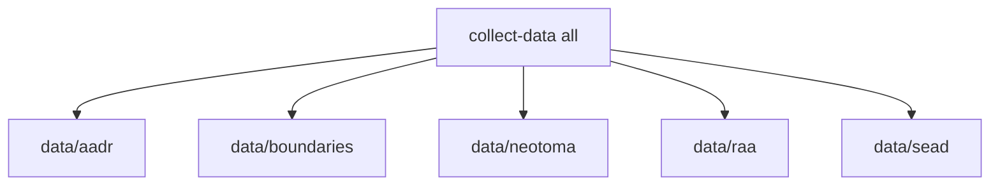

# Rebuild the Data Tree

The repository now uses one unified acquisition command.

## Full Rebuild

```bash
make data-prep
```

Equivalent direct command:

```bash
PYTHONPATH=src artifacts/.venv/bin/python -m bijux_pollenomics.cli collect-data all --version v62.0 --output-root data
```

## What Gets Rebuilt



This command is designed so that deleting `data/` and rerunning it recreates the same top-level directory model and the currently collected normalized outputs.

When you rerun one source collector, that source directory is replaced before new files are written. That keeps recollection deterministic instead of leaving stale files from older runs in place.

## Single-Source Rebuilds

```bash
PYTHONPATH=src artifacts/.venv/bin/python -m bijux_pollenomics.cli collect-data aadr --version v62.0 --output-root data
PYTHONPATH=src artifacts/.venv/bin/python -m bijux_pollenomics.cli collect-data raa --output-root data
```

Use source-specific runs when you are iterating on one acquisition area and do not want to refresh the entire tree.

The current repository also supports:

```bash
PYTHONPATH=src artifacts/.venv/bin/python -m bijux_pollenomics.cli collect-data boundaries --output-root data
PYTHONPATH=src artifacts/.venv/bin/python -m bijux_pollenomics.cli collect-data neotoma --output-root data
PYTHONPATH=src artifacts/.venv/bin/python -m bijux_pollenomics.cli collect-data sead --output-root data
```

## Purpose

This page explains how the unified data collector maps directly onto the five tracked source categories.
