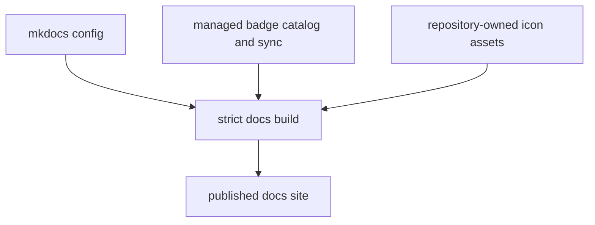

# Documentation Integrity

Docs integrity depends on strict builds and explicit managed surfaces.

## Documentation Integrity Model

This page should show docs integrity as a build contract, not a styling topic.
Configuration, managed content, and asset ownership all have to line up before
the published site can be trusted as a repository surface.

## Current Documentation Surfaces

- `mkdocs.yml` and `mkdocs.shared.yml`
- `docs/badges.md` as the badge catalog consumed by the synchronizer
- `docs/assets/site-icons/` as the repository-owned icon source
- `bijux_pollenomics_dev.docs.badge_sync` as the managed badge renderer

## Boundary

This page describes docs maintenance surfaces, not reader-facing handbook
content. The runtime, data, fieldwork, and atlas pages own the public product
story.

## Design Pressure

The common failure is to treat docs integrity as only content quality, while
ignoring the managed surfaces and strict build rules that actually keep the
site coherent and reproducible.
