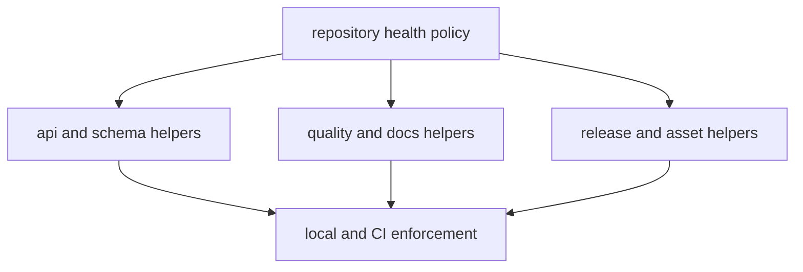

# bijux-pollenomics-dev

`bijux-pollenomics-dev` is the repository-owned maintainer package.

It keeps repository policy executable: API freeze checks, OpenAPI drift checks,
dependency review support, release guards, license synchronization, badge
synchronization, and trusted subprocess rules live here instead of being spread
across shell fragments.

## Package Model

This section should show the package as the place where repository policy
becomes executable. If the page reads like a helper catalog only, readers will
miss why these checks live in Python instead of ad hoc shell fragments.

## Start Here

- open [Package Overview](https://bijux.io/bijux-pollenomics/03-bijux-pollenomics-maintain/bijux-pollenomics-dev/package-overview/)
  for the package boundary
- open [Schema Governance](https://bijux.io/bijux-pollenomics/03-bijux-pollenomics-maintain/bijux-pollenomics-dev/schema-governance/)
  when the question is about API freeze or drift enforcement
- open [Release Support](https://bijux.io/bijux-pollenomics/03-bijux-pollenomics-maintain/bijux-pollenomics-dev/release-support/)
  when publication safety or version resolution is in scope

## Section Pages

- [Package Overview](https://bijux.io/bijux-pollenomics/03-bijux-pollenomics-maintain/bijux-pollenomics-dev/package-overview/)
- [Scope and Non-Goals](https://bijux.io/bijux-pollenomics/03-bijux-pollenomics-maintain/bijux-pollenomics-dev/scope-and-non-goals/)
- [Module Map](https://bijux.io/bijux-pollenomics/03-bijux-pollenomics-maintain/bijux-pollenomics-dev/module-map/)
- [Operating Guidelines](https://bijux.io/bijux-pollenomics/03-bijux-pollenomics-maintain/bijux-pollenomics-dev/operating-guidelines/)
- [Quality Gates](https://bijux.io/bijux-pollenomics/03-bijux-pollenomics-maintain/bijux-pollenomics-dev/quality-gates/)
- [Security Gates](https://bijux.io/bijux-pollenomics/03-bijux-pollenomics-maintain/bijux-pollenomics-dev/security-gates/)
- [Schema Governance](https://bijux.io/bijux-pollenomics/03-bijux-pollenomics-maintain/bijux-pollenomics-dev/schema-governance/)
- [Release Support](https://bijux.io/bijux-pollenomics/03-bijux-pollenomics-maintain/bijux-pollenomics-dev/release-support/)
- [Documentation Integrity](https://bijux.io/bijux-pollenomics/03-bijux-pollenomics-maintain/bijux-pollenomics-dev/documentation-integrity/)

## What This Section Owns

- executable repository-health rules that need Python rather than prose alone
- helpers that fail publication, schema, or dependency work before drift spreads
- repo-level docs and badge maintenance that should not live in the runtime
  package

## First Proof Check

- inspect `packages/bijux-pollenomics-dev/src/bijux_pollenomics_dev/api/`
- inspect `packages/bijux-pollenomics-dev/src/bijux_pollenomics_dev/release/`
- inspect `packages/bijux-pollenomics-dev/tests/`

## Design Pressure

The common failure is to treat maintainer helper code as optional convenience,
when its real job is to keep repository-health policy reviewable, testable, and
reusable across local and CI paths.

## Boundary Test

This package does not own runtime collection logic, normalized data semantics,
or atlas rendering. It owns repository-health enforcement around those surfaces.
