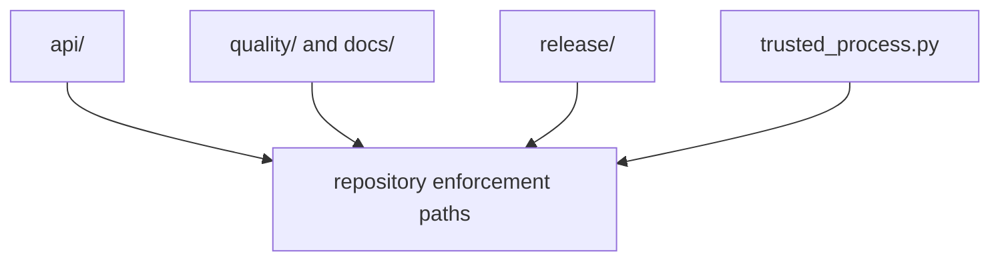

# Module Map

## Module Model

This page should show module families by the repository pressure they absorb,
not just by directory name. The real question is which helper family owns which
kind of guard before drift reaches the public repository surface.

## Current Areas

- `api/` freezes checked-in schemas and detects breaking OpenAPI drift
- `quality/deptry_scan.py` merges repository deptry policy into package scans
- `release/` resolves versions, guards publication, and syncs license assets
- `docs/badge_sync.py` renders managed badge blocks into repository surfaces
- `trusted_process.py` constrains repository-owned subprocess execution

## Design Pressure

The common failure is to read the maintainer package as a flat list of helpers,
which makes it harder to see where API, quality, release, and trust boundaries
are intentionally separated.
