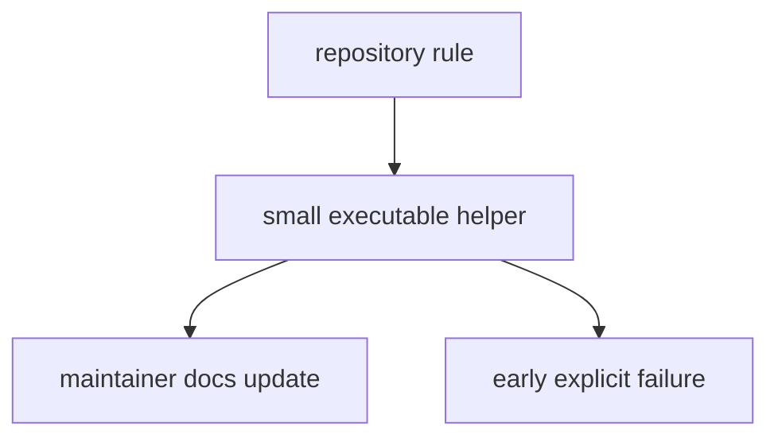

# Operating Guidelines

Maintainer-package changes should narrow ambiguity, not widen it.

## Guideline Model

Maintainer work is healthy only when it keeps repository policy executable,
documents the boundary, and fails early enough that drift does not spread
quietly.

## Guidelines

- keep runtime behavior and repository-health behavior in different packages
- prefer small helpers that fail early and explain the failure clearly
- keep checked-in policy artifacts and executable guards aligned
- add or update maintainer docs when a helper changes what the repository
  allows
- do not let maintainer logic narrow the public story of the repository down to
  one thin data slice
