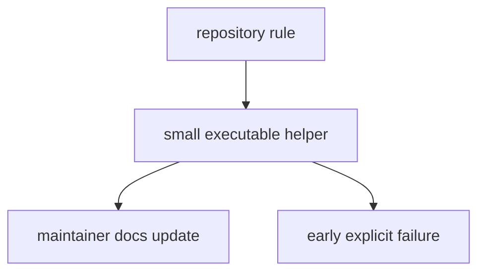

# Operating Guidelines

Maintainer-package changes should narrow ambiguity, not widen it.

## Guideline Model

This page should frame maintainer work as ambiguity reduction. A helper change
is only healthy when it keeps policy executable, documents the boundary, and
fails early enough that drift does not spread quietly.

## Guidelines

- keep runtime behavior and repository-health behavior in different packages
- prefer small helpers that fail early and explain the failure clearly
- keep checked-in policy artifacts and executable guards aligned
- add or update maintainer docs when a helper changes what the repository
  allows

## Design Pressure

The easy failure is to add clever maintainer logic that widens implicit rules,
which usually makes repository policy harder to explain and harder to enforce
consistently.
