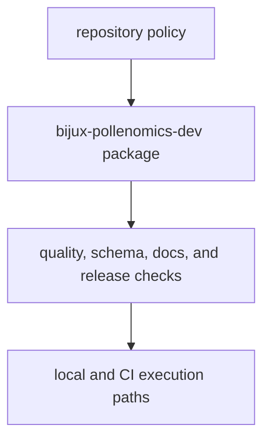

# Package Overview

`bijux-pollenomics-dev` keeps repository-wide maintenance rules in one package
boundary.

## Overview Model

This page should justify the package seam directly: repository-health rules are
kept here so they can be imported, tested, and reused across local and CI
surfaces without duplicating policy in shells and workflows.

## What The Package Owns

- API freeze checks in `api/freeze_contracts.py`
- OpenAPI drift checks in `api/openapi_drift.py`
- dependency review support in `quality/deptry_scan.py`
- release helpers in `release/`
- docs badge synchronization in `docs/badge_sync.py`
- trusted subprocess rules in `trusted_process.py`

## Boundary

This package owns repository-health helpers, not runtime collection or report
publication behavior. It exists so maintenance policy stays executable and
reviewable.

## Design Pressure

The easy failure is to let repository-health logic leak outward into scattered
scripts and workflow snippets, which makes policy drift harder to detect and
harder to test.
