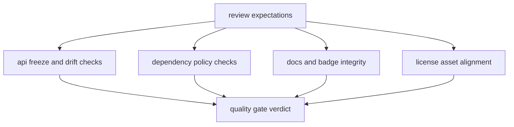

# Quality Gates

`bijux-pollenomics-dev` supports repository quality by turning review rules
into executable checks.

## Quality Gate Model

These gates are proof surfaces, not chores. Each helper turns one review
expectation into an executable stop condition before repository drift escapes
into broader publication claims.

## Current Gates

- API freeze and schema drift checks
- dependency policy checks
- docs and badge integrity checks
- release support and license alignment checks
- repository truth and publication-claim checks where runtime outputs demand it
