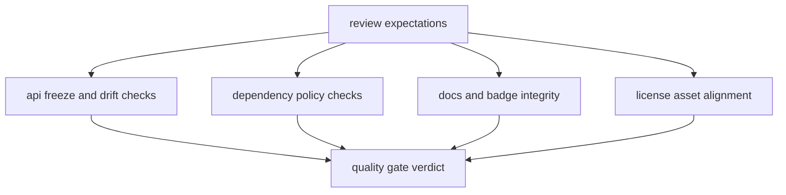

# Quality Gates

`bijux-pollenomics-dev` supports repository quality by turning review rules into
executable checks.

## Quality Gate Model

This page should make quality gates feel like proof surfaces, not chores. Each
helper turns one review expectation into an executable stop condition before a
repository change escapes into broader publication or package drift.

## Current Gates

- `api/freeze_contracts.py` keeps checked-in pinned API artifacts aligned with
  schema files
- `quality/deptry_scan.py` applies repository dependency policy to package
  scans
- `docs/badge_sync.py` keeps managed badge blocks synchronized where required
- `release/license_assets.py` keeps package license assets aligned with root
  sources

## Design Pressure

The easy failure is to treat these checks as unrelated utilities, which hides
that they collectively define what “reviewable repository state” means in
practice.
