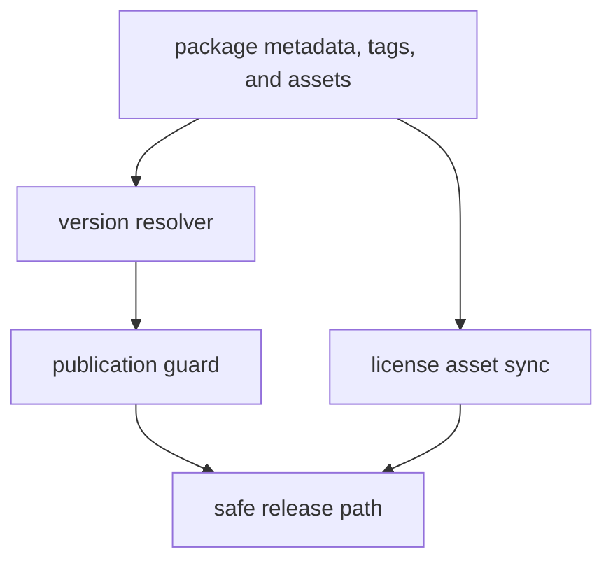

# Release Support

The maintainer package keeps release safety checks close to the repository.

## Release Support Model

This page should show release support as a narrow enforcement chain. The
maintainer package does not publish by itself; it decides whether the release
inputs are coherent enough for Make and GitHub workflows to proceed.

## Current Release Surfaces

- `release/version_resolver.py` resolves package versions from metadata, Hatch,
  or tags
- `release/publication_guard.py` blocks prerelease, dirty, or mismatched
  artifact publication unless explicitly allowed
- `release/license_assets.py` syncs root license assets into package trees

## Boundary

These helpers protect release correctness. They do not perform the full release
workflow by themselves; Make and GitHub Actions call into them.

## Design Pressure

The common failure is to treat release helpers as convenience utilities, which
hides that they are the last local guard before broken version state or dirty
artifacts widen into public publication.
