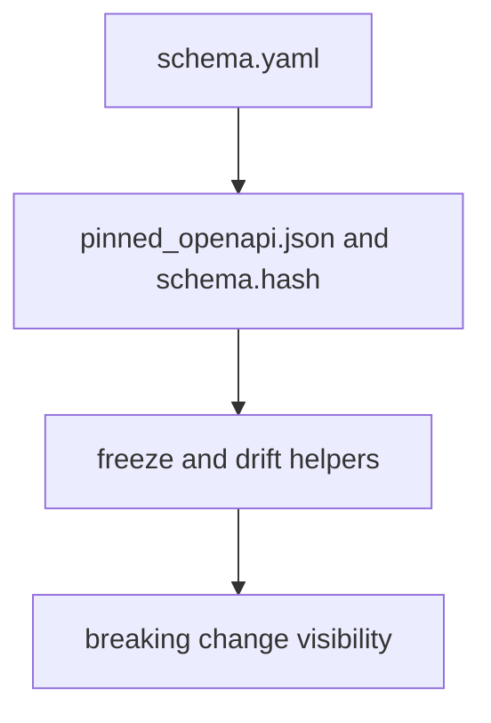

# Schema Governance

Schema governance is enforced through checked-in API artifacts and maintainer
helpers.

## Schema Governance Model

This page should make API governance look like a checked-in contract path, not
just a couple of scripts. The purpose is to keep schema artifacts internally
consistent and to make removals or drift visible before they become silent API
breakage.

## Current Anchors

- `apis/bijux-pollenomics/v1/schema.yaml`
- `apis/bijux-pollenomics/v1/pinned_openapi.json`
- `apis/bijux-pollenomics/v1/schema.hash`
- `bijux_pollenomics_dev.api.freeze_contracts`
- `bijux_pollenomics_dev.api.openapi_drift`

## Boundary

The goal is narrow: keep checked-in schema artifacts internally consistent and
make breaking field removals visible. It does not replace broader API design
review.

## Design Pressure

The easy failure is to talk about schema governance as if the YAML file were
the whole contract, when the repository actually relies on frozen artifacts and
drift checks to prove that contract stayed stable.
