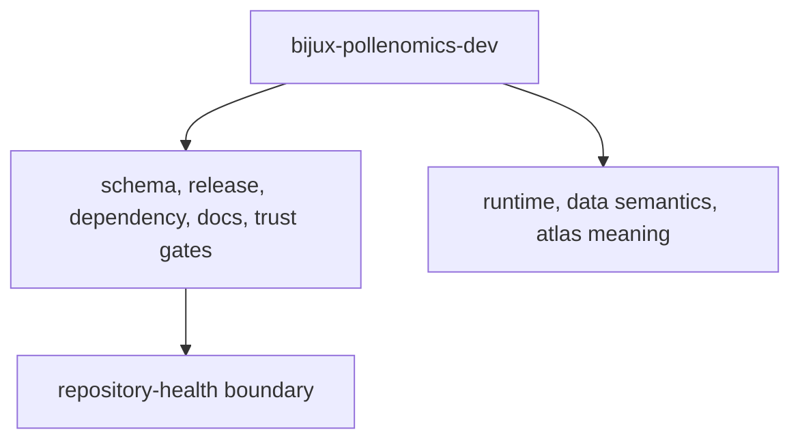

# Scope and Non-Goals

This package is scoped to repository-health behavior.

## Scope Model

This page should help a reader stop the package boundary from drifting. The
maintainer package earns its place only while it stays focused on repository
health instead of pulling runtime or evidence semantics inward.

## In Scope

- API freeze and schema drift enforcement
- release guards and version resolution
- dependency review support
- license and badge synchronization
- trusted subprocess helpers for maintainer commands

## Out of Scope

- source collection logic under `bijux-pollenomics`
- country report generation and atlas rendering
- scientific interpretation or evidence claims

## Design Pressure

The common failure is to let repository-health helpers absorb product logic
because they sit near CI and release machinery, which blurs ownership and makes
both sides harder to review.
