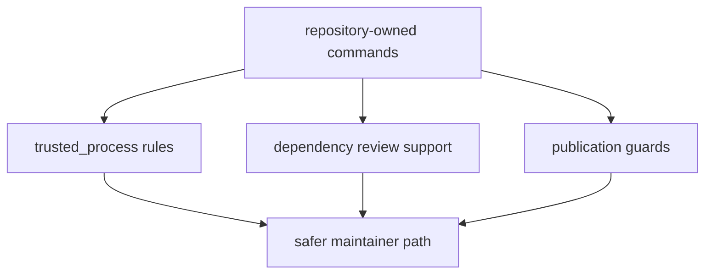

# Security Gates

Security support here is narrow and practical.

## Security Gate Model

This page should make security support look like maintenance-path hardening,
not generic application security. The package narrows obvious unsafe execution,
dependency drift, and accidental publication routes.

## Current Gates

- `trusted_process.py` requires absolute executables for repository-owned
  subprocess calls
- `quality/deptry_scan.py` helps keep dependency review consistent across
  packages
- publication guards stop accidental prerelease or dirty-version publication

## Boundary

This package does not act as a full application security layer. It protects the
repository’s maintenance flows from obvious drift and unsafe publication paths.

## Design Pressure

The easy failure is to overclaim security coverage, which hides the real value
of these helpers: making maintainer commands and release paths less fragile and
less accident-prone.
