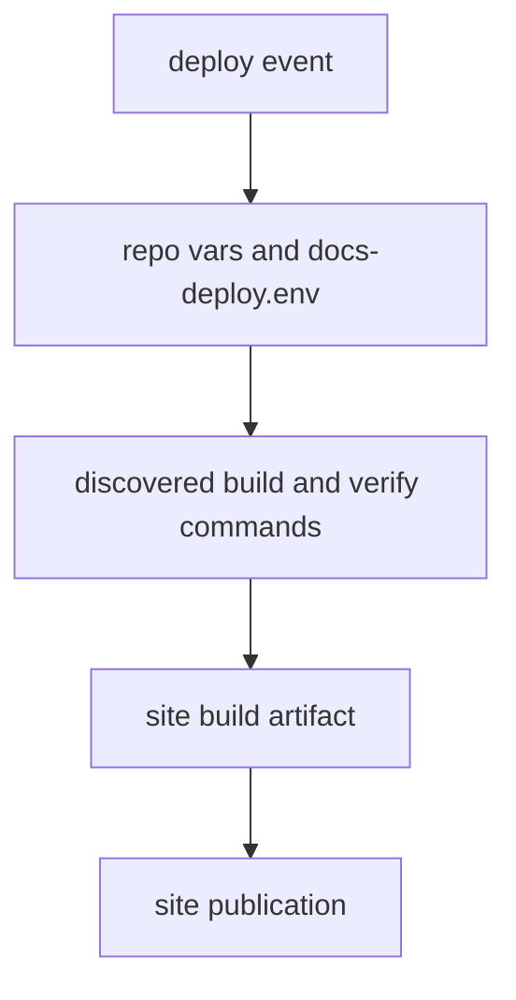

# deploy-docs
`deploy-docs.yml` builds the strict MkDocs site and publishes the documentation
artifact. The workflow follows the shared Bijux docs contract through
`mkdocs.shared.yml` and the repository-specific deployment configuration.

When deployment credentials are available, that artifact becomes the published
site output.

## Docs Deploy Model

This page should make docs deployment look like a controlled publication path.
The workflow resolves repository-specific build behavior, verifies the site,
and only then turns that result into a publishable artifact.

## What It Does

- resolves docs build configuration from repo vars and `.github/docs-deploy.env`
- sets up Python, uv, Node, or Rust only when the repo surface requires them
- discovers install, build, and verify commands from repository targets
- builds the site and publishes a deployable artifact when the event permits it

## Boundary

This workflow owns site publication behavior. It does not define handbook
content quality; the docs pages and local docs targets still own that.

## Design Pressure

The easy failure is to treat docs deployment as a generic hosting step, which
hides how much repository-specific command discovery and verification happens
before publication is allowed.
