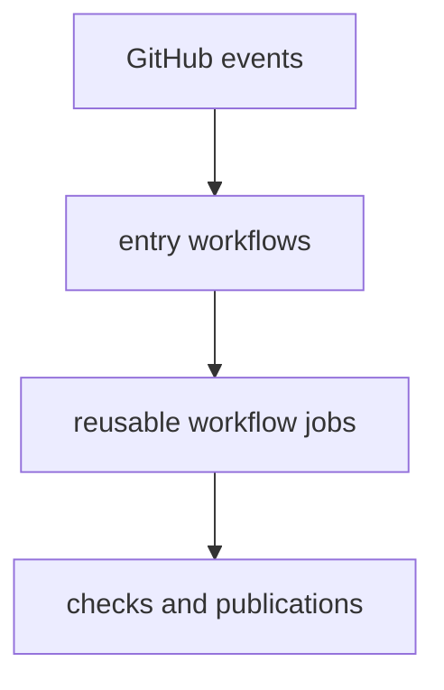

# gh-workflows

This section maps GitHub events to the workflow files that own them.

The main entrypoints are `verify.yml` for repository and package verification,
`deploy-docs.yml` for site publication, and split release workflows for PyPI,
GHCR, and GitHub release publication.

## Workflow Model

This section should help a reader place a failing GitHub run quickly: which
event triggered it, which entry workflow owned it, and whether the real logic
actually lives in a reusable workflow underneath.

## Start Here

- open [verify](https://bijux.io/bijux-pollenomics/03-bijux-pollenomics-maintain/gh-workflows/verify/)
  when the failure starts from push, pull request, or merge-group verification
- open [deploy-docs](https://bijux.io/bijux-pollenomics/03-bijux-pollenomics-maintain/gh-workflows/deploy-docs/)
  when the docs site build or publication is wrong
- open [release-publication](https://bijux.io/bijux-pollenomics/03-bijux-pollenomics-maintain/gh-workflows/release-publication/)
  when a tag-triggered or manual publication run is the issue
- open [reusable-workflows](https://bijux.io/bijux-pollenomics/03-bijux-pollenomics-maintain/gh-workflows/reusable-workflows/)
  when the visible entry workflow delegates into shared job logic

## Section Pages

- [verify](https://bijux.io/bijux-pollenomics/03-bijux-pollenomics-maintain/gh-workflows/verify/)
- [release-publication](https://bijux.io/bijux-pollenomics/03-bijux-pollenomics-maintain/gh-workflows/release-publication/)
- [deploy-docs](https://bijux.io/bijux-pollenomics/03-bijux-pollenomics-maintain/gh-workflows/deploy-docs/)
- [reusable-workflows](https://bijux.io/bijux-pollenomics/03-bijux-pollenomics-maintain/gh-workflows/reusable-workflows/)

## What This Section Settles

- which workflow owns a repository event
- where entry workflows stop and reusable workflow logic begins
- which automation belongs to GitHub Actions instead of local Make routing

## First Proof Check

- inspect `.github/workflows/verify.yml`
- inspect `.github/workflows/deploy-docs.yml`
- inspect `.github/workflows/release-*.yml`

## Design Pressure

The easy failure is to stop at the workflow filename that appeared in GitHub,
even though the meaningful ownership may sit one layer deeper in delegated job
logic.

## Boundary Test

This section explains workflow ownership, not product semantics. Open
[makes](https://bijux.io/bijux-pollenomics/03-bijux-pollenomics-maintain/makes/)
when the real question is local command routing.
