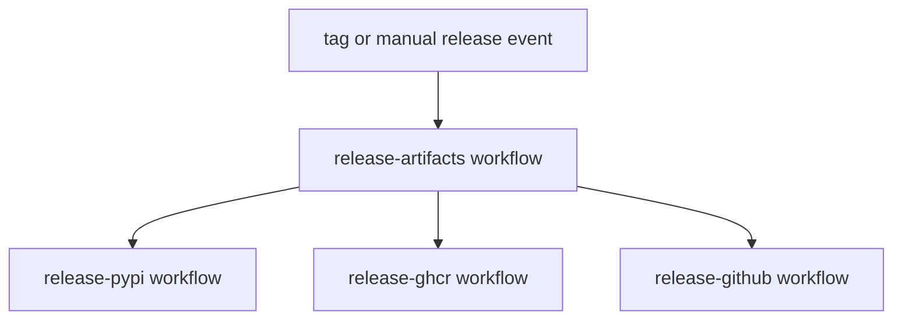

# release-publication

Tagged publication is split across dedicated workflows.

## Release Workflow Model

This page should show why release publication is split: each destination gets
its own inspectable path while sharing one staged artifact build instead of
hiding everything inside one opaque release job.

## Current Job Tree

- `release-artifacts.yml` builds staged package artifacts
- `release-pypi.yml` publishes Python distributions
- `release-ghcr.yml` publishes release bundles to GHCR
- `release-github.yml` assembles the GitHub release and uploads staged assets

## Manual Dispatch Guardrails

Manual dispatch is intentionally strict:

- dispatches that resolve to no selected packages are rejected
- dispatches with disabled publication flags are rejected
- invalid or non-version release tag input is rejected when publication is enabled

These checks prevent no-op release runs and make operator intent explicit.

## Boundary

Release publication is intentionally split by destination. That keeps package
artifacts, OCI bundles, and GitHub release assembly inspectable instead of
hiding all publication logic in one job.

## Design Pressure

The common failure is to prefer one giant release workflow for convenience,
which makes artifact provenance and destination-specific failures much harder to
untangle.
