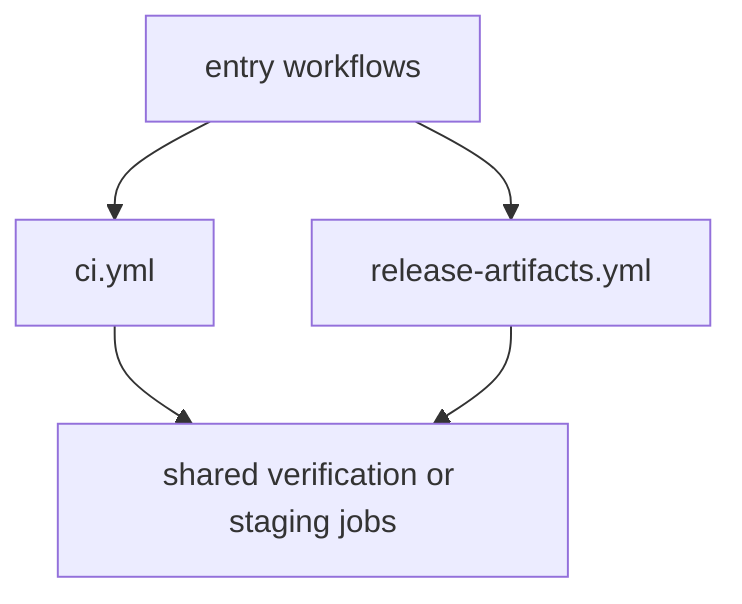

# reusable-workflows

The repository uses reusable workflows so verification and release logic stay
shared.

## Reusable Workflow Model

This page should explain reusable workflows as delegation surfaces, not as
primary entrypoints. They exist so multiple visible workflows can share one job
shape without duplicating fragile logic.

## Current Reusable Workflows

- `ci.yml` as the package-scoped verification worker
- `release-artifacts.yml` as the shared release-artifact builder and stager

## Boundary

These workflows are building blocks, not the primary reader entrypoints. Start
from `verify.yml` or the release workflows when the question begins with a GitHub
event.

## Design Pressure

The easy failure is to start debugging from the reusable workflow alone, which
skips the trigger and entry workflow that actually decided why that reusable
job ran.
