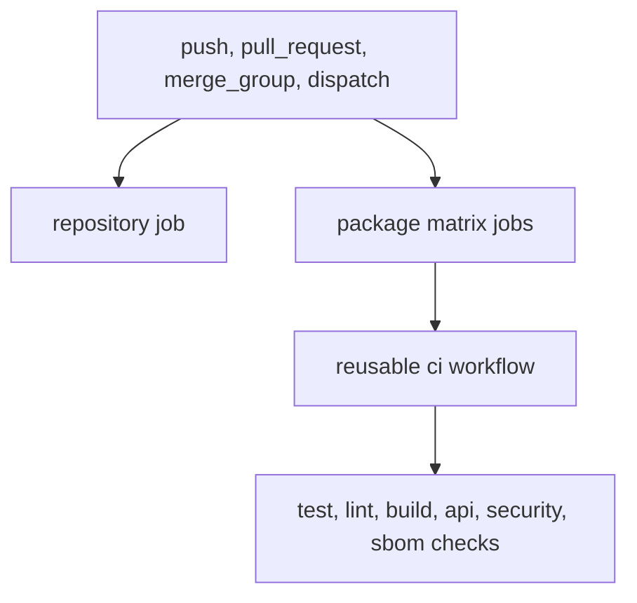

# verify

`verify.yml` is the main repository verification workflow.

## Verify Workflow Model

This page should make the verification path visible from trigger to final check
surface. Readers need to know whether a failure belongs to repository wiring,
package matrix selection, or delegated CI logic underneath.

## What It Runs

- a `repository` job that checks shared make and config contracts
- a package matrix for `bijux-pollenomics`, `pollenomics`, and
  `bijux-pollenomics-dev`
- reusable `ci.yml` jobs for package-scoped test, lint, build, SBOM, API, and
  security surfaces

## Trigger Surface

It runs on pushes, pull requests, manual dispatch, and merge groups for changes
that touch workflows, APIs, configs, docs, makes, packages, or core root files
such as `Makefile`, `mkdocs.yml`, `pyproject.toml`, and `uv.lock`.

## Design Pressure

The common failure is to treat `verify.yml` as one monolithic check, which
hides how repository jobs, package selection, and reusable CI delegation split
ownership of failures.
