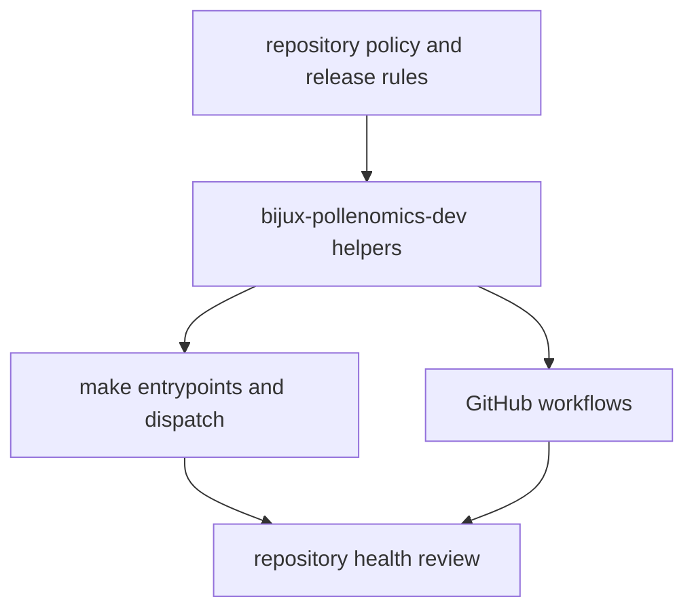

# Maintainer Handbook

This handbook defines the repository-health surfaces that sit above one product
package.

It separates three enforcement layers that are easy to confuse: maintainer
helper code under `packages/bijux-pollenomics-dev/`, shared command routing
under `makes/`, and GitHub-triggered automation under `.github/workflows/`.

## Maintainer Model

This handbook should make one thing legible immediately: repository-health
rules do not live in prose alone. They become helper code, command routing, and
workflow automation that together decide whether a change is safe to publish.

## Start Here

- open [bijux-pollenomics-dev](https://bijux.io/bijux-pollenomics/03-bijux-pollenomics-maintain/bijux-pollenomics-dev/)
  when the rule is enforced by repository-owned Python helper code
- open [makes](https://bijux.io/bijux-pollenomics/03-bijux-pollenomics-maintain/makes/)
  when the question starts from a repository command or CI target
- open [gh-workflows](https://bijux.io/bijux-pollenomics/03-bijux-pollenomics-maintain/gh-workflows/)
  when the issue starts from a GitHub event, check suite, or publication run

## Handbook Pages

- [bijux-pollenomics-dev](https://bijux.io/bijux-pollenomics/03-bijux-pollenomics-maintain/bijux-pollenomics-dev/)
- [makes](https://bijux.io/bijux-pollenomics/03-bijux-pollenomics-maintain/makes/)
- [gh-workflows](https://bijux.io/bijux-pollenomics/03-bijux-pollenomics-maintain/gh-workflows/)

## What This Handbook Settles

- which repository-health rules live in helper code, Make routing, or workflow
  automation
- where release, docs, package, and schema checks are enforced before a public
  package changes
- when a maintainer question should hand back to runtime, data, fieldwork, or
  atlas documentation

## First Proof Check

- inspect `packages/bijux-pollenomics-dev/src/bijux_pollenomics_dev/`
- inspect `makes/root.mk`, `makes/packages.mk`, and `makes/publish.mk`
- inspect `.github/workflows/`

## Design Pressure

The easy failure is to describe maintainer surfaces as three unrelated
mechanisms, which hides how policy, local commands, and GitHub automation
reinforce the same repository-health boundary.

## Boundary Test

This handbook does not explain product behavior. Leave it as soon as the
question becomes runtime commands, data provenance, atlas interpretation, or
fieldwork evidence.
