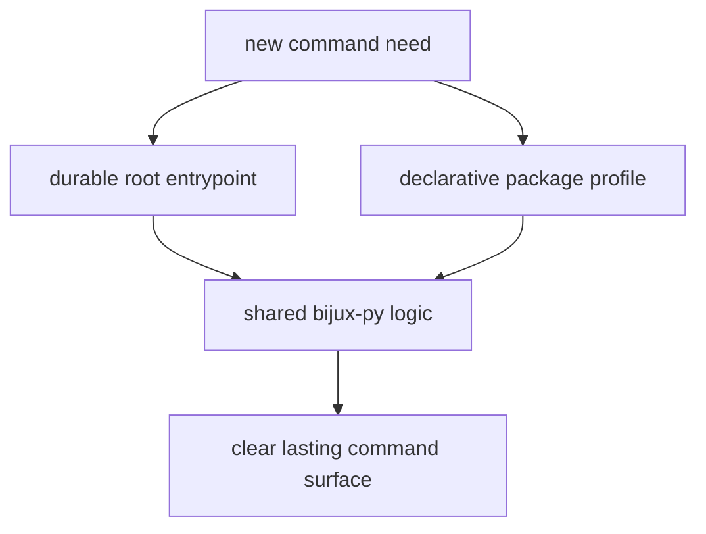

# Authoring Rules

New makefiles should keep repository command surfaces understandable years
later.

## Authoring Model

This page should make make authoring look like boundary discipline. New files
or targets are justified only when they keep the command surface clearer and
more durable than forcing everything through generic or duplicated logic.

## Rules

- keep root entrypoints small and durable
- keep package profiles declarative
- avoid copying shared `bijux-py` logic into repository-local files
- add a new target only when its ownership cannot be expressed through an
  existing surface

## Design Pressure

The easy failure is to add local make logic wherever it seems convenient, which
quickly turns command ownership into a maze of duplicated and aging targets.
