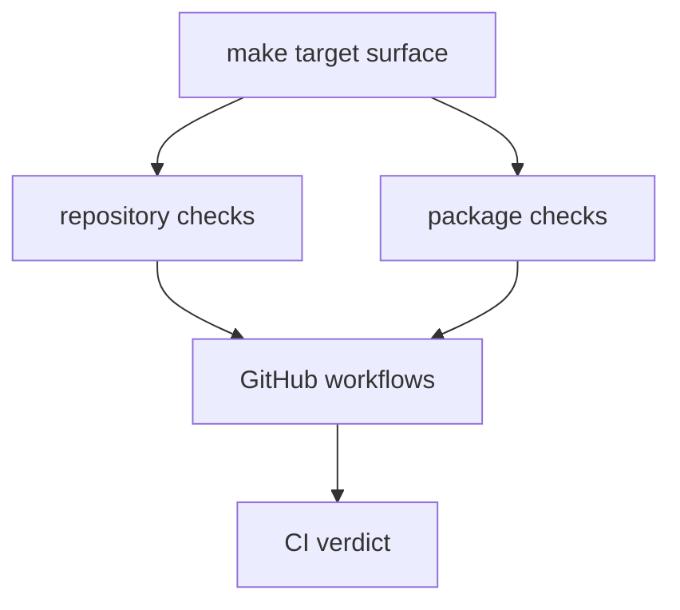

# CI Targets

CI reuses the same repository and package targets exposed through Make.

## CI Target Model

This page should show CI as reuse rather than reinvention. The important point
is that GitHub workflows are not inventing a second verification system; they
are driving the same target surface readers can run locally.

## Common Targets

- `check`
- `lint`
- `test`
- `quality`
- `security`
- `docs`
- `api`
- `build`
- `sbom`

## Design Pressure

The common failure is to treat CI target names as labels only, which hides how
they map back to repository and package checks that should stay coherent across
local and GitHub execution paths.
