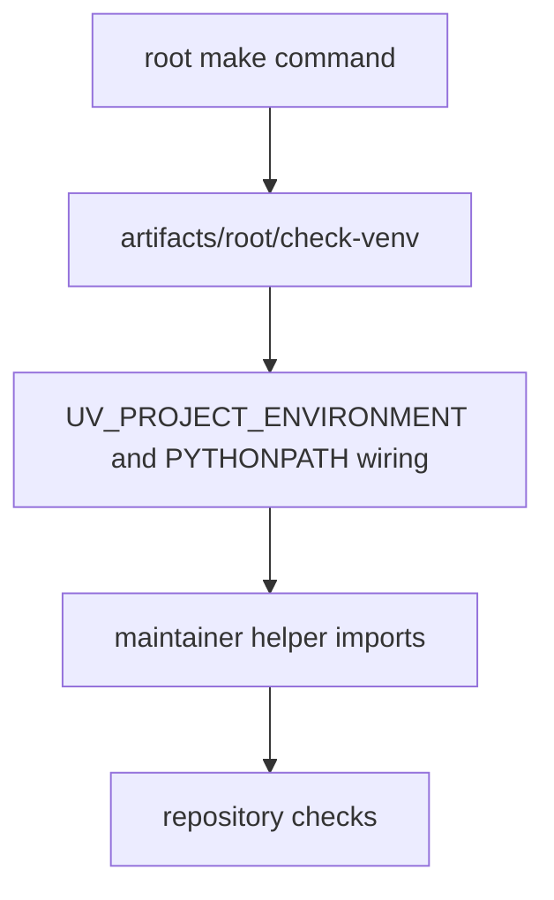

# Environment Model

The make system centers on one repository-local verification environment.

## Environment Model Diagram

This page should show the root verification environment as a controlled local
execution surface. The environment matters because it keeps repository checks
and maintainer helpers running in one predictable place instead of scattering
state across ad hoc shells.

## Current Anchors

- `artifacts/root/check-venv` as the root check environment
- `UV_PROJECT_ENVIRONMENT` wiring in `makes/root.mk`
- `PYTHONPATH` injection for `packages/bijux-pollenomics-dev/src` when
  maintainer helpers run from root commands

## Design Pressure

The common failure is to treat the environment as disposable bootstrapping,
which makes root-command behavior harder to reproduce and maintainer helper
resolution easier to break.
