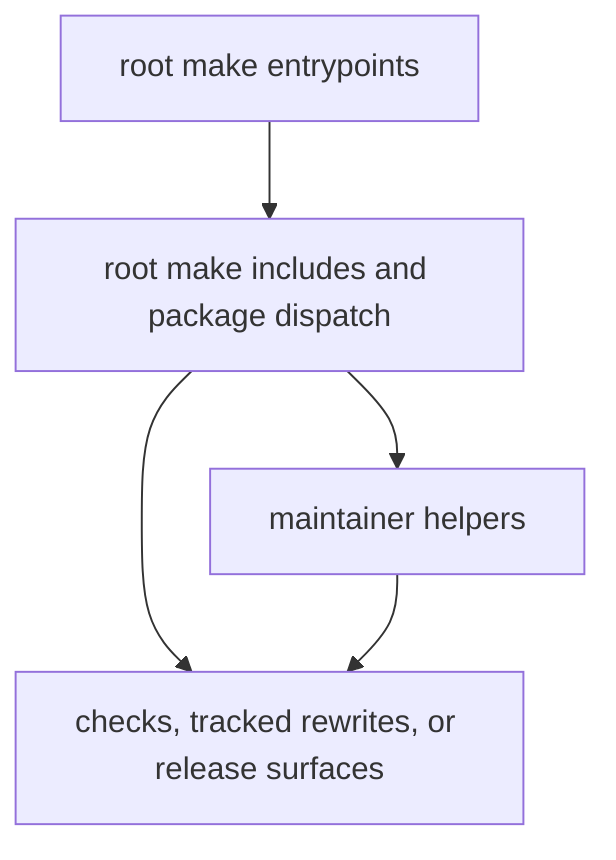

# makes

This section defines the repository make system.

It shows which root commands are stable entrypoints, which targets rewrite
tracked state under `data/` or `docs/report/`, and where Make stops and helper
code or workflow automation takes over.

## Make System Model

This section should make the make system feel like command routing with real
review consequences. Some targets are just verification, while others widen the
tracked data or publication surface and need to be read that way.

## Start Here

- open [Root Entrypoints](https://bijux.io/bijux-pollenomics/03-bijux-pollenomics-maintain/makes/root-entrypoints/)
  for the top-level command surface
- open [CI Targets](https://bijux.io/bijux-pollenomics/03-bijux-pollenomics-maintain/makes/ci-targets/)
  when the question is about package or repository verification
- open [Release Surfaces](https://bijux.io/bijux-pollenomics/03-bijux-pollenomics-maintain/makes/release-surfaces/)
  when the command path touches publication or package artifacts

## Section Pages

- [Make System Overview](https://bijux.io/bijux-pollenomics/03-bijux-pollenomics-maintain/makes/make-system-overview/)
- [Repository Layout](https://bijux.io/bijux-pollenomics/03-bijux-pollenomics-maintain/makes/repository-layout/)
- [Root Entrypoints](https://bijux.io/bijux-pollenomics/03-bijux-pollenomics-maintain/makes/root-entrypoints/)
- [Package Dispatch](https://bijux.io/bijux-pollenomics/03-bijux-pollenomics-maintain/makes/package-dispatch/)
- [Package Contracts](https://bijux.io/bijux-pollenomics/03-bijux-pollenomics-maintain/makes/package-contracts/)
- [Release Surfaces](https://bijux.io/bijux-pollenomics/03-bijux-pollenomics-maintain/makes/release-surfaces/)
- [CI Targets](https://bijux.io/bijux-pollenomics/03-bijux-pollenomics-maintain/makes/ci-targets/)
- [Environment Model](https://bijux.io/bijux-pollenomics/03-bijux-pollenomics-maintain/makes/environment-model/)
- [Authoring Rules](https://bijux.io/bijux-pollenomics/03-bijux-pollenomics-maintain/makes/authoring-rules/)

## What This Section Clarifies

- which commands are repository entrypoints
- which commands widen the tracked review surface
- how package dispatch and publish helpers fit under the root make tree

## First Proof Check

- inspect `Makefile`
- inspect `makes/root.mk`, `makes/packages.mk`, and `makes/publish.mk`
- inspect `makes/packages/*.mk`

## Design Pressure

The common failure is to describe make targets as convenience wrappers only,
which hides which commands actually rewrite tracked evidence or publication
surfaces.

## Boundary Test

This section explains local and CI command routing. Open
[gh-workflows](https://bijux.io/bijux-pollenomics/03-bijux-pollenomics-maintain/gh-workflows/)
when the question is about GitHub-triggered orchestration instead.
