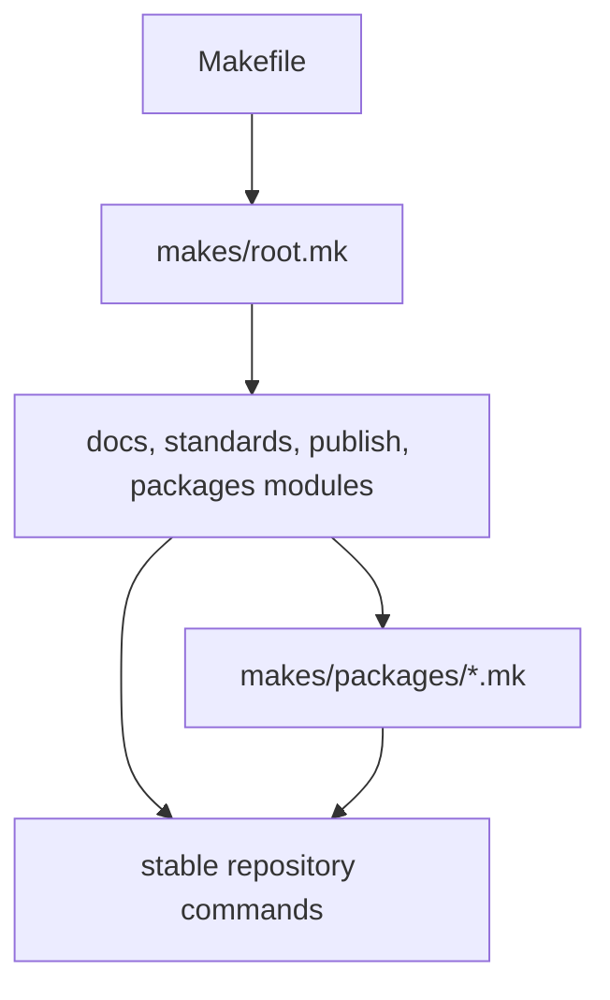

# Make System Overview

The make system is the shared command language for repository maintenance.

## Structure Model

This page should show the make system as a layered include tree that produces
stable repository commands. That shape matters because it tells readers where a
command is declared, widened, or delegated.

## Current Structure

- `Makefile` includes `makes/root.mk`
- `makes/root.mk` loads shared env, package catalog, docs, standards, and
  repository command modules
- package-specific behavior stays under `makes/packages/*.mk`

## Design Pressure

The common failure is to treat the make tree as one flat command surface, which
makes ownership and change impact much harder to trace.
