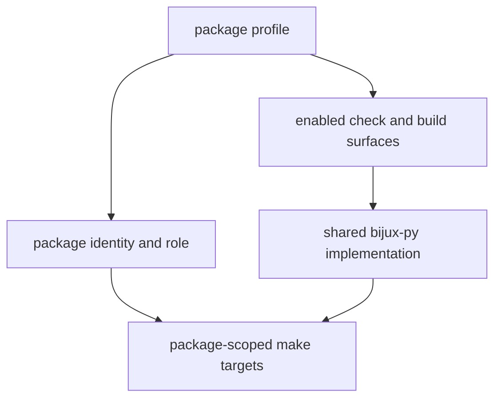

# Package Contracts

Package profiles under `makes/packages/` declare package identity and enabled
check surfaces while delegating shared implementation to `bijux-py`.

## Contract Model

This page should make package contracts look like declared capabilities, not
just scattered make flags. The profile tells the make system what kind of
package it is dealing with and which shared machinery it is allowed to attach.

## What The Profiles Declare

- package slug and role
- whether the package is buildable
- whether SBOM and API surfaces are enabled
- where package-scoped make targets should attach

## Design Pressure

The easy failure is to treat package profiles as incidental config, which makes
it much harder to see why one package exposes API or SBOM targets while another
one intentionally does not.
