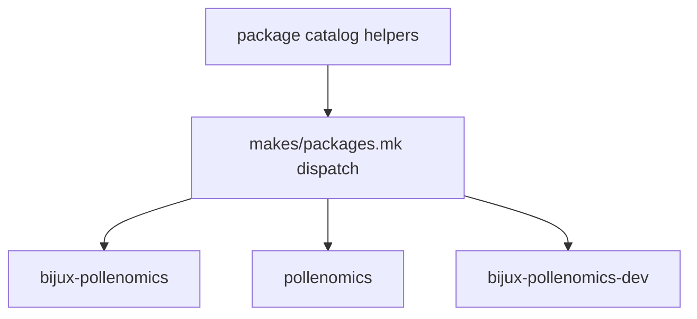

# Package Dispatch

Package dispatch is driven by `makes/packages.mk` and shared catalog helpers.

## Dispatch Model

This page should make package dispatch feel like explicit routing, not
incidental iteration. The repository needs readers to see which package role
each target lands on before they assume one command path fits every package.

## Current Package Records

- `bijux-pollenomics` as the primary package with check, build, SBOM, and API
  surfaces
- `pollenomics` as the compatibility package
- `bijux-pollenomics-dev` as the maintainer package

## Design Pressure

The common failure is to flatten packages into one shared command surface,
which hides why compatibility and maintainer packages need different dispatch
behavior than the primary product package.
