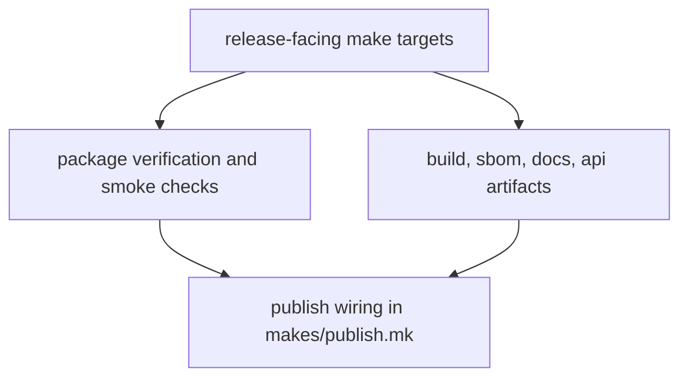

# Release Surfaces

The make system exposes release-facing targets for package build, verification,
SBOM generation, docs preparation, and API freeze support.

## Release Surface Model

This page should make release surfaces feel like a staged proof path. Release
targets are valuable because they keep verification, artifact preparation, and
publish wiring visible before anything reaches a public destination.

## Current Anchors

- `package-check`, `package-smoke`, and `package-source-smoke`
- `package-verify` as the packaging proof surface
- `makes/publish.mk` for version resolution and publication guard wiring

## Design Pressure

The easy failure is to see release targets as just packaging shortcuts, which
hides how they bundle together proof, artifact preparation, and publish
eligibility.
