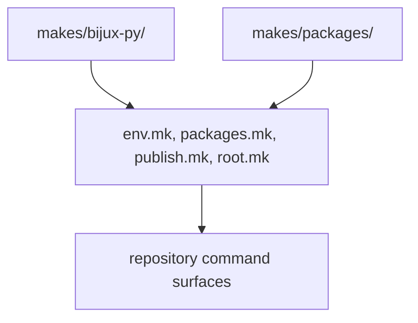

# Repository Layout

`makes/` keeps shared logic, repository policy, and package profiles visibly
separate.

## Layout Model

This page should show the make tree as an ownership layout, not just a folder
listing. The split exists so shared contracts, repository policy, and package
profiles can change without collapsing into one undifferentiated command layer.

## Core Areas

- `makes/bijux-py/` for shared make contracts
- `makes/packages/` for package profiles
- `makes/env.mk`, `makes/packages.mk`, `makes/publish.mk`, and `makes/root.mk`
  for repository-owned coordination

## Design Pressure

The common failure is to read the make directory as one flat implementation
bucket, which makes shared versus repository-owned logic much harder to keep
separate over time.
