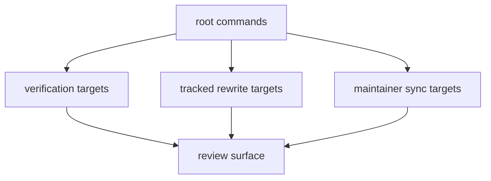

# Root Entrypoints

The root entrypoint is intentionally small: `Makefile` includes `makes/root.mk`.

## Entrypoint Model

This page should separate commands by blast radius. Some entrypoints only check
state, while others rewrite tracked data, reports, or managed repository
surfaces and need to be judged as real change paths.

## Stable Repository Commands

- `check` runs the full repository verification flow
- `data-prep` refreshes tracked source data under `data/`
- `reports` refreshes tracked report outputs under `docs/report/`
- `app-state` rebuilds tracked data, reports, and docs
- `sync-badges` and `sync-license-assets` run repository-owned maintainer sync
  helpers

## Design Pressure

The easy failure is to read all root commands as equally safe convenience
entrypoints, which hides which ones widen the tracked review surface.
