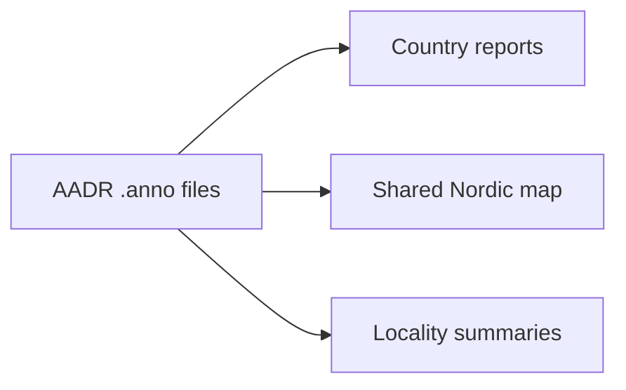

# AADR

`data/aadr/` contains the tracked AADR metadata inputs used by the country reports and the shared map.

## Current Tracked Inputs

- `data/aadr/v62.0/1240k/v62.0_1240k_public.anno`
- `data/aadr/v62.0/ho/v62.0_HO_public.anno`

## Why Only `.anno`

The current repository logic needs:

- genetic IDs
- locality names
- political entity values
- latitude and longitude
- publication and date fields

Those fields are already in the public `.anno` files, so tracking the heavier genotype matrices would increase repository weight without helping the current report or map workflow.

## What The Collector Does

The current collector resolves the requested `.anno` files from the public AADR Harvard Dataverse metadata and writes them into:

- `data/aadr/v62.0/1240k/v62.0_1240k_public.anno`
- `data/aadr/v62.0/ho/v62.0_HO_public.anno`

The repository does not currently collect or use `.geno`, `.ind`, `.snp`, or spreadsheet companions.

## Acquisition Command

```bash
PYTHONPATH=src artifacts/.venv/bin/python -m bijux_pollen.cli collect-data aadr --version v62.0 --output-root data
```

## Role In The Product



## Purpose

This page explains why AADR is tracked as metadata-first input rather than as a full genotype repository.
