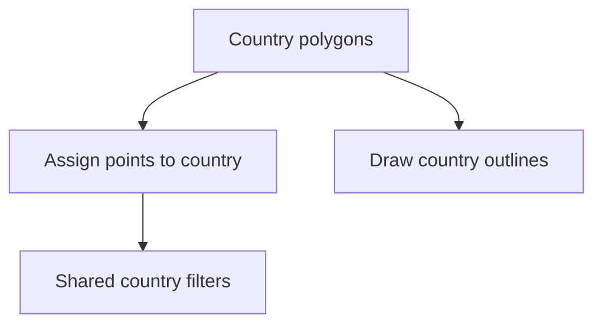

# Boundaries

`data/boundaries/` holds the Nordic country polygons used for classification and map framing.

## What It Produces

- raw country GeoJSON files under `data/boundaries/raw/`
- a combined Nordic boundary collection under `data/boundaries/normalized/nordic_country_boundaries.geojson`

## Current Raw Files

- `data/boundaries/raw/denmark.geojson`
- `data/boundaries/raw/finland.geojson`
- `data/boundaries/raw/norway.geojson`
- `data/boundaries/raw/sweden.geojson`

## Why It Matters

Without boundaries, the repository cannot apply one consistent country filter to AADR, Neotoma, SEAD, and Sweden-specific archaeology overlays.

## Acquisition Command

```bash
PYTHONPATH=src artifacts/.venv/bin/python -m bijux_pollen.cli collect-data boundaries --output-root data
```

## Product Role



## Purpose

This page explains why country boundaries are treated as first-class tracked data instead of as incidental display assets.
