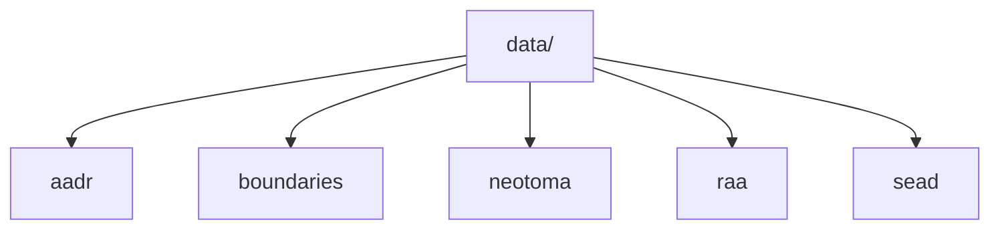

# Data Guide

This section explains the five tracked data categories under `data/`, the commands that build them, and the boundaries of what each source currently contributes.

## Pages in This Section

- [Data categories](data-categories.md)
- [AADR](aadr.md)
- [Boundaries](boundaries.md)
- [Neotoma](neotoma.md)
- [SEAD](sead.md)
- [RAÄ](raa.md)

## Core Rule

The filesystem model and the acquisition model should match. That is why `collect-data <source>` writes directly into `data/<source>/`.

The collector also writes `data/collection_summary.json`, and when a source depends on boundaries it reuses tracked local boundary files when available instead of fetching them again unnecessarily.

## Canonical Status

This section is the canonical source for data acquisition and storage guidance inside the docs site. It replaces the older narrative content that previously lived in separate `docs/data/...` pages.

## Purpose

This page organizes the source-specific documentation for the tracked data tree.
