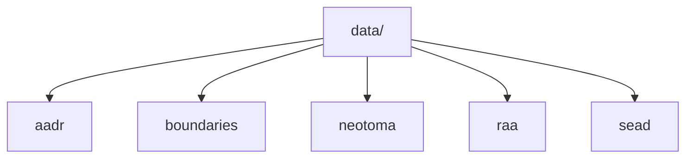

# Data Guide

This section explains the five tracked data categories under `data/` and the reason each one exists.

## Pages in This Section

- [Data categories](data-categories.md)
- [AADR](aadr.md)
- [Boundaries](boundaries.md)
- [Neotoma](neotoma.md)
- [SEAD](sead.md)
- [RAÄ](raa.md)

## Core Rule

The filesystem model and the acquisition model should match. That is why `collect-data <source>` writes directly into `data/<source>/`.

## Purpose

This page organizes the source-specific documentation for the tracked data tree.
