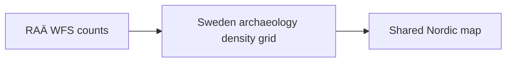

# RAÄ

`data/raa/` contains Swedish archaeology metadata and a map-optimized archaeology density layer derived from RAÄ / Fornsök.

## What It Produces

- raw capabilities, schema, and domain metadata under `data/raa/raw/`
- Swedish archaeology metadata and density GeoJSON under `data/raa/normalized/`

## Why Density Instead Of Every Point

RAÄ contains hundreds of thousands of published Swedish archaeology records. Rendering every point directly in the shared map would be too heavy and visually noisy, so the current product uses a density layer for the browser-facing view.



## Acquisition Command

```bash
PYTHONPATH=src .venv/bin/python -m bijux_pollen.cli collect-data raa --output-root data
```

## Scope Boundary

The current RAÄ layer is Sweden-only. That is intentional because the present archaeology integration target is Swedish site interpretation around pollenomic sampling candidates.

## Purpose

This page explains why RAÄ is both source-faithful and browser-optimized at the same time.
