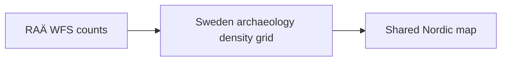

# RAÄ

`data/raa/` contains Swedish archaeology metadata and a map-optimized archaeology density layer derived from RAÄ / Fornsök.

## What It Produces

- raw capabilities, schema, and domain metadata under `data/raa/raw/`
- Swedish archaeology metadata and density GeoJSON under `data/raa/normalized/`

## What The Current Collector Does

The current collector:

- downloads RAÄ WFS capabilities and schema metadata
- downloads Fornsök domain metadata
- queries exact RAÄ feature counts for all published sites, `Fornlämning`, and `Fornlämning` plus `Möjlig fornlämning`
- builds a 1-degree Swedish density grid by issuing RAÄ WFS count queries cell by cell

## Why Density Instead Of Every Point

RAÄ currently contributes national-scale Swedish archaeology context. The checked-in map uses a density layer rather than individual point markers because the source count is large enough that direct marker rendering would be heavy and visually noisy in a static HTML artifact.



## Acquisition Command

```bash
PYTHONPATH=src .venv/bin/python -m bijux_pollen.cli collect-data raa --output-root data
```

## Scope Boundary

The current RAÄ layer is Sweden-only. That is an implementation fact of the current repository, not a claim about archaeology coverage in the other countries.

## Purpose

This page explains why RAÄ is both source-faithful and browser-optimized at the same time.
