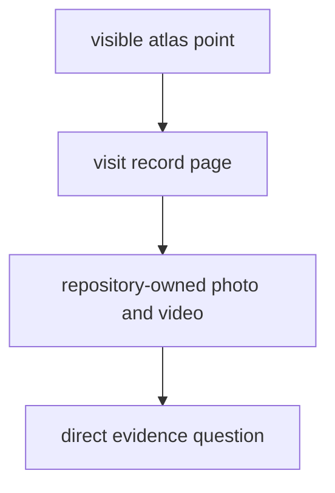

# Fieldwork

Fieldwork is the checked-in evidence layer for real sampling visits.

It exists so a reader can move from one published atlas point to the direct
visit record behind it: where the team went, when sampling happened, and which
repository-owned media support that statement.

## Fieldwork Model

This section should make fieldwork feel like a narrow proof bridge from one
published point to one documented visit. If the route from map point to direct
media is not obvious, the page stops earning its place as a distinct evidence
surface.

## Start Here

- open [Lyngsjön Lake Fieldwork](https://bijux.io/bijux-pollenomics/04-fieldwork/lyngsjon-lake-fieldwork/)
  for the current visit record
- open the [Nordic Evidence Atlas](https://bijux.io/bijux-pollenomics/report/nordic-atlas/nordic-atlas_map.html)
  when the question starts from a visible map point
- open the [data handbook](https://bijux.io/bijux-pollenomics/02-bijux-pollenomics-data/)
  when the question is really about source provenance or normalization

## Section Pages

- [Lyngsjön Lake Fieldwork](https://bijux.io/bijux-pollenomics/04-fieldwork/lyngsjon-lake-fieldwork/)

## What This Section Settles

- whether a published fieldwork point refers to a documented visit
- which date, location, and media support that visit record
- where fieldwork evidence ends and atlas or source-derived evidence begins

## First Proof Check

- inspect `docs/gallery/2026-02-26-data-collection.JPG`
- inspect `docs/gallery/2026-02-26-data-collection.mp4`
- compare the visit record with the corresponding atlas point

## Design Pressure

The easy failure is to let one documented visit imply broader field coverage
than the repository actually proves. This section only works when it stays
narrow and inspectable.

## Boundary Test

This section does not imply that every atlas point has matching field media and
it does not replace the data handbook. It is a narrow direct-evidence surface.
