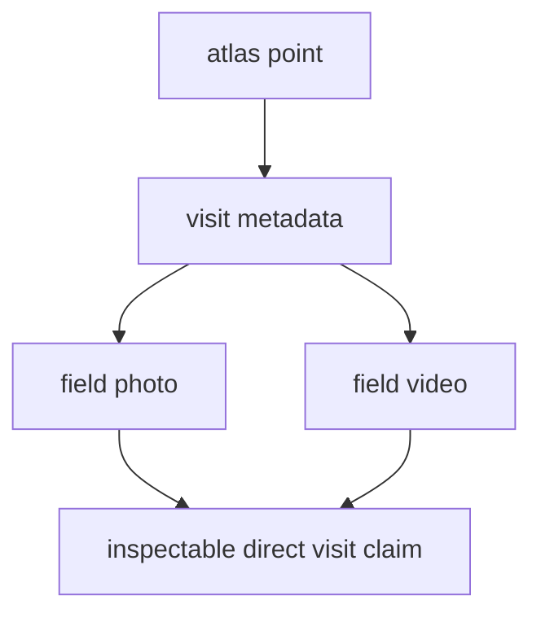

# Lyngsjön Lake Fieldwork

This page is the direct visit record for the fieldwork point published in the
Nordic Evidence Atlas.

It ties one visible atlas point to one checked-in collection event with photo
and video evidence stored in this repository.

## Visit Evidence Model

This page should let a reader verify one direct-evidence claim quickly: the
published point corresponds to a real visit, on a real date, with repository
media that can be inspected without leaving the docs surface.

## Visit Record

- lake: Lyngsjön Lake
- country: Sweden
- regional description: southwest of Kristianstad
- sampling date: `2026-02-26`
- atlas coordinates: `55.9319529, 14.0659044`

## Repository Evidence

- photo: `docs/gallery/2026-02-26-data-collection.JPG`
- video: `docs/gallery/2026-02-26-data-collection.mp4`
- atlas layer label: `Fieldwork documentation`
- atlas point title: `Lyngsjön Lake field sampling`

[Open the Nordic Evidence Atlas](https://bijux.io/bijux-pollenomics/report/nordic-atlas/nordic-atlas_map.html){ .md-button .md-button--primary }
[Open the field video](https://bijux.io/bijux-pollenomics/gallery/2026-02-26-data-collection.mp4){ .md-button }
[Open the field photo](https://bijux.io/bijux-pollenomics/gallery/2026-02-26-data-collection.JPG){ .md-button }

{ loading=lazy }

<figure class="bijux-media-card">
  <video controls preload="metadata" muted playsinline>
    <source src="../../gallery/2026-02-26-data-collection.mp4" type="video/mp4">
    <a href="../../gallery/2026-02-26-data-collection.mp4">Open the field video.</a>
  </video>
  <figcaption>Field documentation from Lyngsjön Lake during winter sampling on 2026-02-26. Playback starts muted.</figcaption>
</figure>

## Safe Reading

- a documented visit happened at the published location on `2026-02-26`
- the repository keeps direct media for that visit
- the atlas can link to repository-owned field evidence instead of only to
  upstream database layers

## Design Pressure

The common failure is to read a documented visit as representative field
coverage rather than what it really is: one inspectable anchor for one atlas
point.

## Boundary

This page does not turn the atlas into a field-log system and it does not imply
that one visit is representative of regional pollen evidence. Its job is to
make one real visit inspectable.
