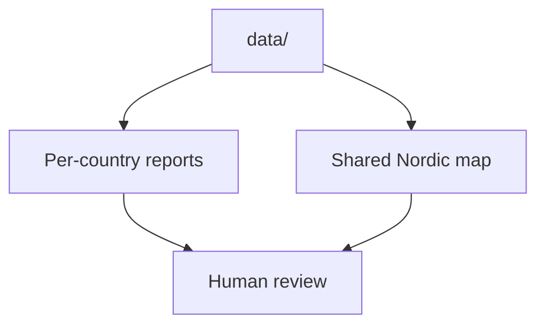

# Reports

This section explains the browser-facing and file-facing outputs generated from the tracked `data/` tree.

## Pages in This Section

- [Country reports](country-reports.md)
- [Shared Nordic map](shared-nordic-map.md)
- [Published artifacts](published-artifacts.md)

## Purpose

This page organizes the output-side documentation for `bijux-pollen`.
