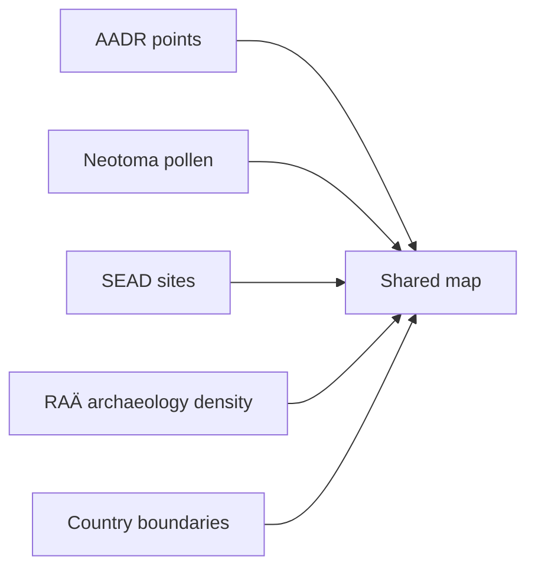

# Shared Nordic Map

The shared Nordic map is the main interactive product surface in this repository.

## Current Behavior

- one map for Sweden, Norway, Finland, and Denmark
- include and exclude by country
- include and exclude by data layer
- distance circles around point layers
- clustering, search, zoom, and layer summaries

## Layer Model

## Why One Shared Map

One shared map is better than multiple country-specific maps because readers can:

- compare countries quickly
- keep one mental model for controls and layers
- inspect borderland or regional patterns without changing pages
- apply the same distance logic across all countries

## Current Published File

- `docs/report/nordic/nordic_aadr_v62.0_map.html`

## Purpose

This page explains the product logic behind the map-first documentation experience and the current shared-map design.
