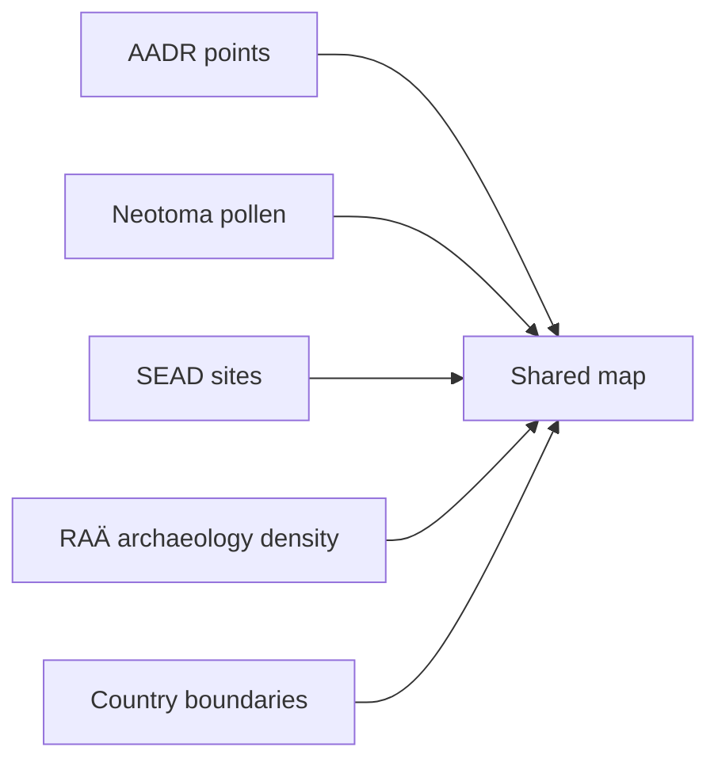

# Shared Nordic Map

The shared Nordic map is the main interactive product surface in this repository.

## Current Behavior

- one map for Sweden, Norway, Finland, and Denmark
- include and exclude by country
- include and exclude by data layer
- grouped layer controls for primary evidence, environmental context, archaeology context, and orientation
- distance circles around point layers
- clustering, search, zoom, empty-state handling, and live layer summaries
- shareable URL state for country, layer, basemap, and distance selections

## Current Scope Limits

- the AADR layer is tied to release `v62.0` in the current checked-in artifact
- the RAÄ archaeology layer is Sweden-only in the current implementation
- the map is a static HTML artifact, not a backed web application
- the map bundle now carries its own Leaflet and marker-cluster assets locally, but basemap tiles still come from external services, so a fully offline browser session will not render the full map experience

## Layer Model

## Why One Shared Map

One shared map is better than multiple country-specific maps because readers can:

- compare countries quickly
- keep one mental model for controls and layers
- inspect borderland or regional patterns without changing pages
- apply the same distance logic across all countries

## Information Model

The map now treats AADR as one source inside a broader multi-evidence view.

- AADR release labels are shown as provenance, not as the map title
- every layer carries its own source and coverage description
- RAÄ archaeology is explicitly described as Sweden-only density coverage
- the live summary separates map build date from source release labels

## Current Published File

- `docs/report/nordic/nordic_aadr_v62.0_map.html`
- `docs/report/nordic/nordic_aadr_v62.0_summary.json`

## Purpose

This page explains the product logic behind the map-first documentation experience and the current shared-map design.
