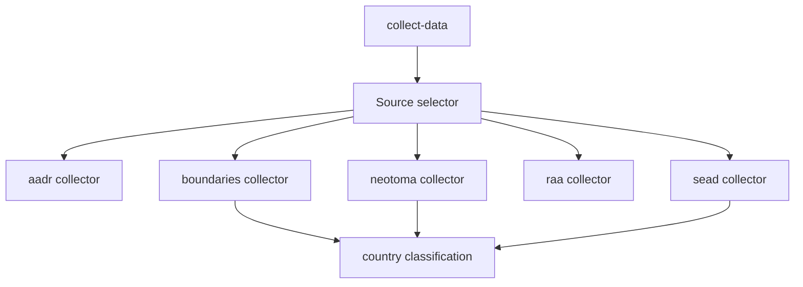

# Data Collection Flow

The repository now uses one unified collection command, but the implementation stays source-specific under the hood.

## Flow

## Important Design Choice

`collect-data all` is a convenience surface, not a collapse of source boundaries. Each source still has its own module, output directory, and normalization logic.

## Why This Matters

That design keeps the system:

- easy to reason about
- easy to test by source
- easy to update incrementally
- aligned with the top-level `data/` directory model

## Purpose

This page explains how the unified CLI command coexists with a source-aware internal architecture.
