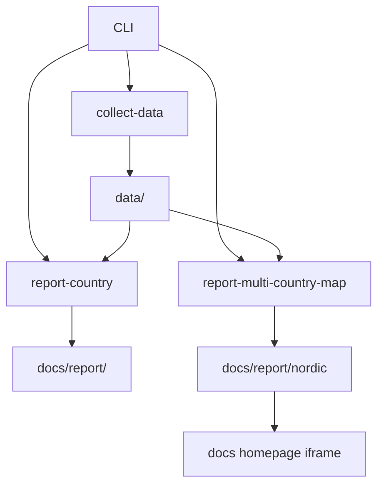

# System Overview

`bijux-pollenomics` is a file-oriented pipeline, not a server application.

## Major Components

- `src/bijux_pollenomics/data_downloader/`: data acquisition and normalization
- `src/bijux_pollenomics/reporting/`: AADR report and map generation
- `data/`: tracked source inputs and normalized source products
- `docs/report/`: generated report artifacts
- `mkdocs.yml` and `docs/`: published documentation shell

## Processing Model

## Why This Architecture Is File-Centric

The repository’s outputs need to be:

- reproducible
- reviewable in git
- publishable as static documentation assets
- easy to rebuild without hidden services

## Purpose

This page explains the top-level system shape before readers move into source ownership or collection flow details.
