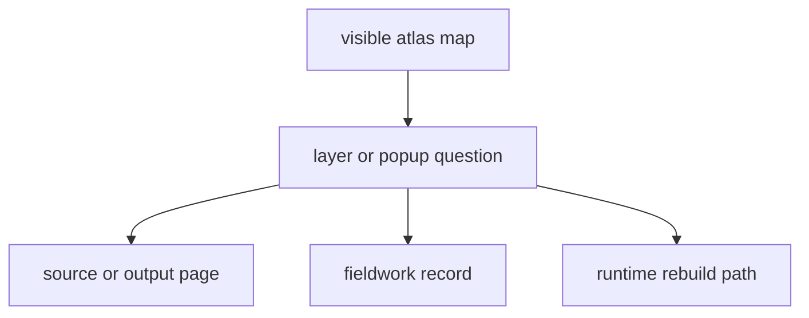

# Nordic Evidence Atlas

The Nordic Evidence Atlas is the main public evidence surface of the
repository.

Start here when the fastest way to judge the repository is to inspect what a
reader actually sees: the map, the layers, the point popups, and the visible
relationship between ancient DNA, pollen, archaeology, boundaries, and
fieldwork.

## Atlas Reading Model

This page should make the atlas feel like a routing surface rather than a
self-sufficient claim. Readers start from what they can see, then branch into
source, output, fieldwork, or runtime proof depending on what the layer is
actually saying.

  <a class="md-button md-button--primary" href="https://bijux.io/bijux-pollenomics/report/nordic-atlas/nordic-atlas_map.html">Open the Nordic Evidence Atlas</a>
  <a class="md-button" href="https://bijux.io/bijux-pollenomics/02-bijux-pollenomics-data/outputs/nordic-atlas/">Open atlas output reference</a>
  <a class="md-button" href="https://bijux.io/bijux-pollenomics/04-fieldwork/">Open fieldwork record</a>

  <strong>Phone view:</strong> Open the atlas in its own tab for full map
  controls.

  <iframe src="https://bijux.io/bijux-pollenomics/report/nordic-atlas/nordic-atlas_map.html" title="Nordic Evidence Atlas"></iframe>

## Start Here

- open the atlas first when the visible publication surface is the question
- open [atlas output reference](https://bijux.io/bijux-pollenomics/02-bijux-pollenomics-data/outputs/nordic-atlas/)
  when the issue is about shipped files, generated assets, or checked-in map
  components
- open [source pages](https://bijux.io/bijux-pollenomics/02-bijux-pollenomics-data/sources/)
  when a visible layer needs an upstream explanation
- open [fieldwork](https://bijux.io/bijux-pollenomics/04-fieldwork/)
  when a point appears to refer to a direct visit record
- open the [runtime handbook](https://bijux.io/bijux-pollenomics/01-bijux-pollenomics/)
  when the question is how the map was rebuilt or validated

## What This Page Settles

- what the current public map publication looks like
- where a visible layer, point, or polygon should route next for support
- which evidence families are being rendered together without pretending they
  are interchangeable

## First Proof Check

- inspect `docs/report/nordic-atlas/nordic-atlas_map.html`
- inspect `docs/report/nordic-atlas/` for the bundled GeoJSON, JSON, and asset
  files
- compare one visible layer with its source, output, or fieldwork page before
  making a broad claim

## Design Pressure

The easy failure is to trust the map presentation more than the routed evidence
behind it. This page works only when it keeps that branch-out path explicit.

## Boundary Test

The map is a publication surface, not self-sufficient proof. A reliable read
usually starts here and then branches into source, output, fieldwork, or
runtime documentation depending on what the visible layer is actually claiming.
