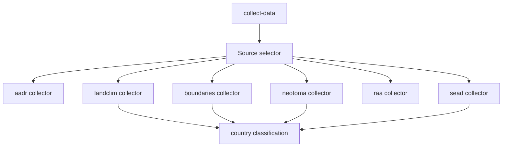

# Data Collection Flow

The repository uses one unified collection command, but the implementation stays source-specific under the hood.

## Flow

## Collection Seams

- requested-source normalization decides which collectors should run
- collector orchestration manages staging, boundaries, and summary writing
- per-source collectors own raw fetch and normalization details
- source metadata and executable collector lookup stay separate so adding a source does not require rewriting unrelated orchestration logic

## Important Design Choice

`collect-data all` is a convenience surface, not a collapse of source boundaries. Each source still has its own module, output directory, and normalization logic.

When one source is recollected, its output directory is replaced rather than appended to. That keeps source snapshots reviewable and prevents stale files from earlier collector behavior surviving by accident.

## Why This Matters

That design keeps the system:

- easy to reason about
- easy to test by source
- easy to update incrementally
- aligned with the top-level `data/` directory model

## Review Rule

When the collection path changes, the relevant review surface is not only the CLI command. Review should also cover changed source directories under `data/`, the shared collection summary, and any downstream publication artifacts affected by those new inputs.

## Purpose

This page explains how the unified CLI command coexists with source-specific collection seams and source-specific output directories.
