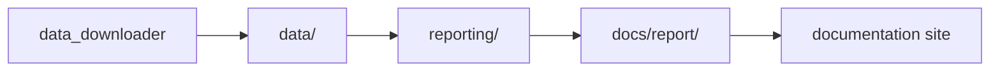

# Architecture

This section explains how the repository is put together and where responsibilities live.

Read it when the question is about seams, ownership, or flow between modules and generated trees rather than about command syntax.

## Pages in This Section

- [System overview](system-overview.md)
- [Data collection flow](data-collection-flow.md)
- [Publication flow](publication-flow.md)
- [Codebase layout and ownership](codebase-layout-and-ownership.md)

## Core Boundary

## Use This Section When You Need To

- trace how data moves from the CLI into `data/` and then into `docs/report/`
- understand which module owns a contract or filename family
- extend the codebase without collapsing source, reporting, and docs responsibilities into one place

## Purpose

This page organizes the architecture explanations around system seams instead of developer workflow.
