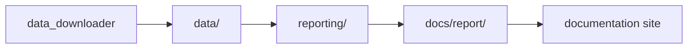

# Architecture

This section explains how the repository is put together and where responsibilities live.

## Pages in This Section

- [System overview](system-overview.md)
- [Data collection flow](data-collection-flow.md)
- [Codebase layout and ownership](codebase-layout-and-ownership.md)

## Core Boundary

## Purpose

This page organizes the architecture explanations for the repository.
